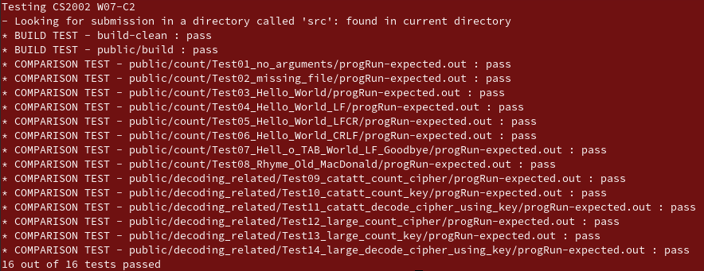
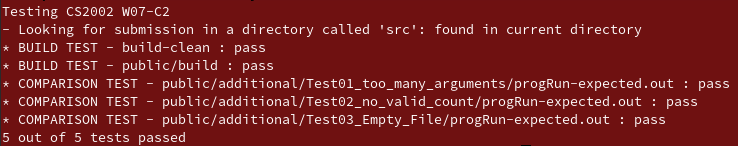

# W07 Practical Report

## Overview

The specification required that a program which reads in the characters from a file and counts the occurrences of each alphabetic (upper case and lower case regraded as the same) or whitespace character in the file. Then after this program is complete it is required that a program which decodes from two files (key and cipher). Where the cipher is the correct order of the characters and the key has the correct letters. There is 1-1 mapping between key and cipher of letter which have the same number of occurrences. 

It is required that the file names be taken in the form of command line arguments.  If 1 argument is passed in then it means the occurrences of characters are being. Where are If 2 arguments are passed then that means that the key and cipher have been passed. Everything else is considered invalid.

### Assumptions

#### Counting Occurrences

* Only counter Alphabetic and Whitespace Characters
* All whitespace characters are treated as one character type.

#### Decoding

* The number of occurrences of a character is unique
* Special Characters other than: Alphabetical and Whitespace are ignored.

## Design

To store the occurrences of each letter an ordered linked list was made.

```c
typedef struct _node {
    char character;
    int count;
    struct _node *next;
} node;
```

This means that a fixed length array doesn't need to be stored to count the occurrences of characters. Only characters which are found are stored. This also made it easier to handle as the length of linked list can be determined by going all the way to the end of the linked list.

It was decided to keep the main method and the `counterMain.c` as simple as possible. So all the necessary methods required to implement where abstracted to another file called `counter.c`. The header file `counter.h` contains the definition for the Node and also the necessary libraries which are to be used outwith the file by `counterMain.c`.

```c
(node *) malloc(sizeof(node))
```

This was used when dynamically creating a node and setting the address of the node to the value of a pointer.

Recursion was used to insert into linked list. As the following checks would be performed on the following node. Also it was found that recursion was much cleaner representation of what was being performed by the code.

## Testing

### `stacscheck`

This is the output from `stacscheck`



### Additional Tests

Additional tests were created to further test the functionality of the program. Here is there output.



#### Two many arugments

The `stacscheck` failed to determine what would have if more arguments that required were provided to the program. It is expected that the usage commands be printed

#### No Valid Count

The `stacscheck` failed to determine what would occur if the file contained no valid characters. It is expected that the count be 1 as a carriage return has been found.

#### Empty File

The`stacscheck` failed to determine what would occur if the file contained no characters. It is expected that the total count is zero. it is expected total count be printed.

## Evaluation

A problem that was encountered was that when I wanted to get the total of the characters from linked list. Since the total was required before the individual count of the character if I was to traverse all of them before them to sum total I and then loop again to print. I would have have to run two loops. Alternatively if I decided to store the output as a string and sum then print the string. Both of these were determined to be very inefficient. Use of global variable Global Variable `total` was created instead as functions can only return 1 value. So `incremementCount` would just return the `base` of linked list and the total would be manipulated by functions as global variable.

When deciphering the file, the cipher is file is read in 2 times. This was done so code for part 1 could be reused for key and cipher. As counting was done for both key and cipher, then linked lists created for both. Once the counting of character had been totalled for both then the the 1st file can be open and the replacement of characters can be done in a streamed manner. 

Given more time maybe a constructor could have been developed which creates nodes.

## Conclusion

