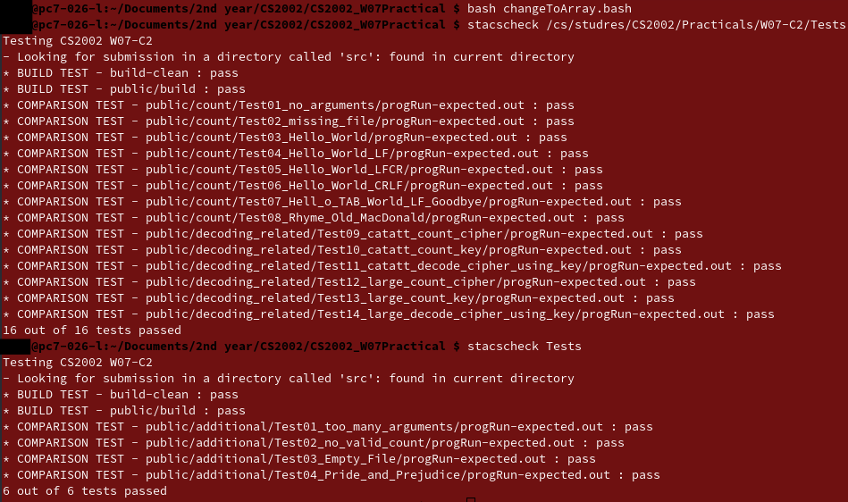
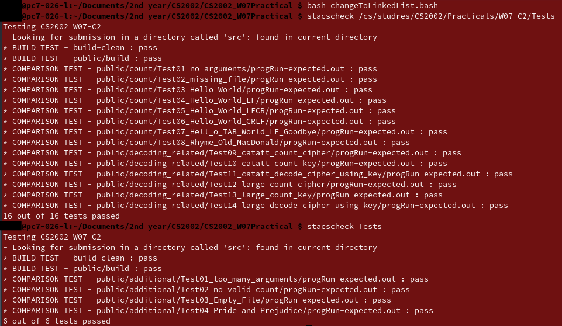

# W07 Practical Report

## Overview

The specification required that a program which reads in the characters from a file and counts the occurrences of each alphabetic (upper case and lower case regraded as the same) or whitespace character in the file. Then after this program is complete it is required that a program which decodes from two files (key and cipher). Where the cipher is the correct order of the characters and the key has the correct letters. There is 1-1 mapping between key and cipher of letter which have the same number of occurrences. 

It is required that the file names be taken in the form of command line arguments.  If 1 argument is passed in then it means the occurrences of characters are being. Where are If 2 arguments are passed then that means that the key and cipher have been passed. Everything else is considered invalid.

### Assumptions

#### Counting Occurrences

* Only count Alphabetic and Whitespace Characters
* All whitespace characters are treated as one character type.

#### Decoding

* The number of occurrences of a character is unique
* Special Characters other than: Alphabetical and Whitespace are ignored.
* That the key and cipher are always complementary with 1-1 mapping.

## Design

It was determined that there was multiple was to implement these programs effectively and both had their trade-offs.

### Main

To keep the main method as simple as possible it was decide main method would only call methods which would perform the desired functionality. Only the length of arguments were check in the main method. To prevent unnecessary importing of `<stdio.h>` the error reporting was abstracted to `charcterCount` file.4

### `characterCount`

All the essential functionality of the program is carried out by this file and its functions.

#### `new_occurence`

Gets the occurrences of character and stores them in the `node` collection. This allows the total counts to be obtained for both when you need to obtain total counts to be printed and need the counts to be determined for the key and cipher. This makes the program more modular.

#### `setGroup`

Determines the group the characters belong to. Only Whitespace and Alphabetical characters are required to be stored and this determines if the character belongs to 1 of these valid groups.

#### `decrpyt`

Re reads the cipher file and decodes each character and prints the decoded character.

### `countCollection.h`

Represents a reference to the necessary methods and defined structure in which the collection used to manipulated by `characterCount`.

#### `decode`

behaves and represents a map in the program as it takes in a character and (cipher and key) and maps the given character to unique value.

### Linked List Implementation

To store the occurrences of each letter an ordered linked list was made.

```c
typedef struct _node {
    char character;
    int count;
    struct _node *next;
} node;
```

This means that a fixed length array doesn't need to be stored to count the occurrences of characters. Only characters which are found are stored. 

It was decided to keep the main method and the `counterMain.c` as simple as possible. So all the necessary methods required to implement where abstracted to another file called `counter.c`. The header file `counter.h` contains the definition for the Node and also the necessary libraries which are to be used outwith the file by `counterMain.c`.

```c
(node *) malloc(sizeof(node))
```

This was used when dynamically creating a node and setting the address of the node to the value of a pointer.

Recursion was used to insert into linked list. As the following checks would be performed on the following node. Also it was found that recursion was much cleaner representation of what was being performed by the code.

When freeing the space dynamically allocated to store Collections. The linked list needs to be recursively free as each individual node may point to another.

### Array Implementation

To store to occurrences of each letter an array was defined inside a structure as follows.

```c
typedef struct _node {
    int character['z' - '-'];
    int total;
}
```

A array of size 27 is created which gives enough space for stores all the characters. Total was stored as its own variable, allowing it to be instantly referenced and so no global variable needed to be created. 

Special indicators where created to allow the indicators `WHITESPACE` was used to indicate the index of a white space character and `ALPHABETICAL`  was used to get the offset of a ASCII character. To get a to value of 1 the code `characterCounter.character[‘a’ - ALPHABETICAL]` would be used. It was suggest that direct `ASCII` values be used as Key but the value of z is 122 (largest of valid characters). So an array of length 123 would need to be created which waste far more space than 27.

### Map

The structure that could have been used to implement a Map Collection is

```c
typedef struct _map {
  struct _node cipher;
  struct _node key;
} map;
```

could have been used to map cipher and key to the character but it was decided against as this was just futile copying of data that already exists. So the node instead the combination of the (key and cipher) nodes would be used to represent the map. As you would still have all the information pre

### Totals

It is not possible to get a negative total so `unsigned int` is used. This allows the maximum size which can be counted to larger. Still using the same amount of space as an int.

## Testing

To run tests using Array Implementation please run from main directory.

```bash
bash changeToArray.bash
stacscheck /cs/studres/CS2002/Practicals/W07-C2/Tests
stacscheck Tests
```

To run tests using Linked List Implementation please run from main directory.

```bash
bash changeToLinkedList.bash
stacscheck /cs/studres/CS2002/Practicals/W07-C2/Tests
stacscheck Tests
```

### Unit Tests

Unit testing was performed on the methods to ensure under given circumstances they were giving the correct output.

### Additional Tests

#### Two many arugments

The `stacscheck` failed to determine what would have if more arguments that required were provided to the program. It is expected that the usage commands be printed

#### No Valid Count

The `stacscheck` failed to determine what would occur if the file contained no valid characters. It is expected that the count be 1 as a carriage return has been found.

#### Empty File

The`stacscheck` failed to determine what would occur if the file contained no characters. It is expected that the total count is zero. it is expected total count be printed.

#### Pride and Prejudice

The `stacscheck` used very small samples. Here all the words in the book Pride and Prejudice by Jane Austin are counted.

### Testing Output

#### For Array Implementation



#### For Linked List Implementation



## Evaluation

A problem that was encountered was that when I wanted to get the total of the characters from linked list. Since the total was required before the individual count of the character if I was to traverse all of them before them to sum total I and then loop again to print. I would have have to run two loops. Alternatively if I decided to store the output as a string and sum then print the string. Both of these were determined to be very inefficient. Use of global variable Global Variable `total` was created instead as functions can only return 1 value. So `incremementCount` would just return the `base` of linked list and the total would be manipulated by functions as global variable.

When deciphering the file, the cipher is file is read in 2 times. This was done so code for part 1 could be reused for key and cipher. As counting was done for both key and cipher, then linked lists created for both. Once the counting of character had been totalled for both then the the 1st file can be open and the replacement of characters can be done in a streamed manner. 

Given more time maybe a constructor could have been developed which creates nodes. Instead of directly using `malloc`. In general collections could have been further abstracted. Only having methods which directly manipulated collection objects.

It was found that the array implementation was much easier to code. No recursion was required. Get elements was faster and didn’t require traversing the collection. In general using the linked list list would not save space as seen for Jane Austin a large sample. That most counts for sufficient sizes will have every of the 27 characters in large amounts. So it can be said that the array one is more effective implementation.

## Conclusion

In this practical a collection store character counts was created. The program was able to count the number of characters present in a file passed in. The program was able to decipher a file given a key. The data structure used allowed for efficient storage and manipulation of the character counts.

Specification prove difficult to read. So it was hard to understand the requirements that the program needed to meet. So time was initial waste trying to understand what was asked.

Given more time more error checking could have been developed for the decipher part of the program.

## References

[1] <https://www.hackerearth.com/practice/data-structures/linked-list/singly-linked-list/tutorial/> Linked List Implementation

[2] <http://www.cplusplus.com/reference/cstdlib/malloc/> Malloc usuage.

[3] <https://www.tutorialspoint.com/c_standard_library/c_function_free.htm> free usuage c

[4] <https://stackoverflow.com/questions/6417158/c-how-to-free-nodes-in-the-linked-list> freeing nodes of a linked list

[5] <http://www.asciitable.com/> ascii character reference